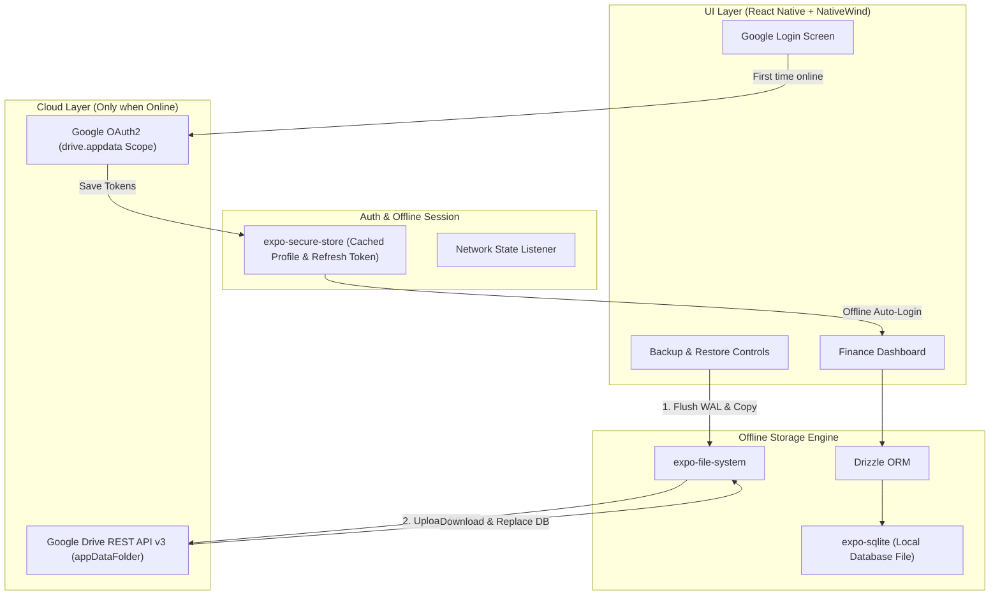

Here is a comprehensive architectural analysis and roadmap for building **Hawk** as a local-first personal finance app with Google authentication, SQLite + Drizzle ORM, and Google Drive backup/restore.

---

### High-Level Architecture Overview



---

### 1. Database & ORM Layer (Offline Core)

Because Hawk is designed to work completely offline, the database runs locally on the device with zero cloud latency.

#### Recommended Stack

- **`expo-sqlite`**: The official high-performance SQLite driver for Expo.
- **`drizzle-orm`**: A lightweight, type-safe ORM that integrates directly with `expo-sqlite/next`.
- **`drizzle-kit`**: For schema migrations and schema generation.

#### Key Architectural Requirements

1. **Schema Structure**:
   - `accounts` (e.g., Cash, Bank, Credit Card)
   - `categories` (Income & Expense categories, icons, colors)
   - `transactions` (amount, type, date, note, accountId, categoryId)
   - `budgets` (monthly budget thresholds)
   - `metadata` (schema version, last backup timestamp)
2. **Safe Backup Handling (WAL Mode)**:
   - Modern SQLite uses Write-Ahead Logging (WAL), creating `.db-wal` and `.db-shm` files alongside the main `.db` file.
   - **Crucial Rule**: Before reading or copying the database file to upload to Google Drive, you must run:
     ```sql
     PRAGMA wal_checkpoint(TRUNCATE);
     ```
     This flushes all pending memory changes from the WAL file into the single main `.db` file so the backup is 100% consistent and uncorrupted.

---

### 2. Google Authentication & Offline Access

#### The Strategy

The user must sign in with Google once on initial setup, but subsequent opens must **never** block the user if they are on an airplane or have no cellular data.

#### Key Components

1. **Auth Library**:
   - **`@react-native-google-signin/google-signin`** (Recommended): Provides native Google Play Services sign-in on Android and native Google SDK on iOS.
   - Needs OAuth scopes:
     - `email` and `profile`
     - `https://www.googleapis.com/auth/drive.appdata` (Drive App Data folder)
2. **Session Persistence**:
   - On initial successful sign-in, store the user profile, user ID, and OAuth refresh tokens in **`expo-secure-store`** (encrypted keychain/keystore).
3. **Offline Auth Flow**:
   - On app launch, check `expo-secure-store`:
     - If user credentials exist: **Immediately allow entry into the app** without pinging Google servers.
     - If no credentials exist: Prompt the Google Sign-in screen (requiring internet connection).

---

### 3. Google Drive Backup & Restore Architecture

#### Why `drive.appdata` Scope?

Instead of requesting full Google Drive access (which requires complex Google privacy verification and exposes all user files), use the **Application Data Folder** (`drive.appdata`):

- It is a dedicated, hidden folder inside the user’s Google Drive reserved strictly for your app.
- The user cannot accidentally delete or corrupt the database file from their Drive UI.
- It requires much lighter OAuth verification from Google.

#### Backup Flow (Local -> Google Drive)

1. **Check Connectivity**: Ensure the device is online via `@react-native-community/netinfo`.
2. **Token Refresh**: Ensure the Google OAuth access token is valid (refresh it via Google OAuth endpoint if expired).
3. **Checkpoint Database**: Execute `PRAGMA wal_checkpoint(TRUNCATE)` on SQLite.
4. **Read File**: Use `expo-file-system` to read the `.db` file path (e.g. `FileSystem.documentDirectory + 'SQLite/hawk.db'`).
5. **Upload via Drive REST API v3**:
   - Call the Google Drive multipart upload endpoint:
     `POST https://www.googleapis.com/upload/drive/v3/files?uploadType=multipart`
   - Target parent: `parents: ["appDataFolder"]`.
   - Metadata: Name (e.g., `hawk_backup.db`), MIME type `application/x-sqlite3`, modified time.
6. **Save Status**: Record the `last_backup_time` locally.

#### Restore Flow (Google Drive -> Local)

1. **Search Drive**: Query `GET https://www.googleapis.com/drive/v3/files?spaces=appDataFolder` for `hawk_backup.db`.
2. **Download File**: Download the backup binary file using `expo-file-system` to a temporary directory (`hawk_temp.db`).
3. **Close & Replace**:
   - Safely close the active `expo-sqlite` connection to release file locks.
   - Copy `hawk_temp.db` over the existing `hawk.db`.
   - Delete any leftover `-wal` and `-shm` cache files.
4. **Re-initialize ORM**: Reconnect Drizzle to the restored database and refresh the React state/cache.

---

### 4. Important Native Consideration: Development Builds

Because Google Sign-in and native Drive scopes rely on native credentials (`google-services.json` on Android and `GoogleService-Info.plist` on iOS):

- **Expo Go will not support this natively.**
- You will use **Expo Prebuild / Development Builds** (`npx expo run:android` or EAS development build).
- You configure the plugins in [app.json](file:///home/mustha/Projects/Hawk/app.json) so native code is generated automatically without touching `ios/` or `android/` folders directly (per Continuous Native Generation rules).

---

### Recommended Implementation Roadmap

Here is the build order reformatted as a sequential list:

1.  Phase 1: Local Database Setup

- Milestone: Configure expo-sqlite and drizzle-orm, define financial schemas, and write basic CRUD operations.
  - Primary Libraries: expo-sqlite, drizzle-orm, drizzle-kit

2.  Phase 2: App Layout & Navigation

- Milestone: Set up Expo Router screens: Auth screen, Dashboard, Transactions, and Settings.
  - Primary Libraries: expo-router, nativewind

3.  Phase 3: Google Authentication

- Milestone: Configure Google Cloud Console OAuth 2.0 Client IDs, add @react-native-google-signin/google-signin, and implement offline session caching with expo-secure-store.
  - Primary Libraries: @react-native-google-signin/google-signin, expo-secure-store

4.  Phase 4: Drive Backup & Restore Service

- Milestone: Build a dedicated Drive service module to checkpoint SQLite, upload to appDataFolder, and handle restore & file overwriting.
  - Primary Libraries: expo-file-system, Google Drive REST API v3

5.  Phase 5: UI Controls & Network Guard

- Milestone: Add Backup & Restore buttons with progress spinners, last backup timestamps, and offline detection.
  - Primary Libraries: @react-native-community/netinfo


